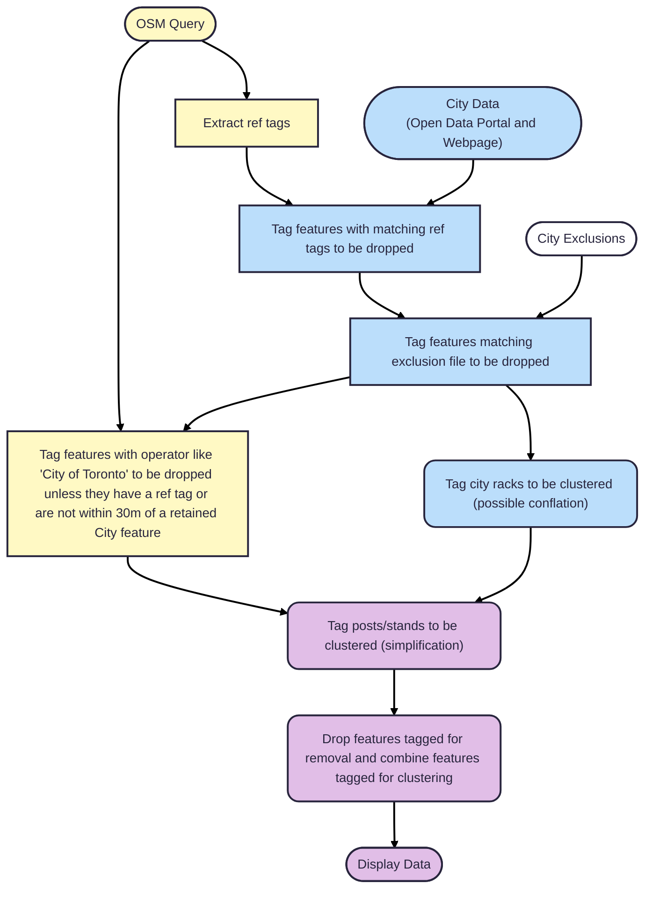

# Bicycle Parking Data

## Downstream Processing

```mermaid
---
config:
  theme: redux
---

flowchart TD
    A(["OSM Query"]) --> B["Extract ref tags"] & n5@{ label: "Tag features with operator like 'City of Toronto' to be dropped unless they have a ref tag or are not within 30m of a retained City feature" }
    B --> n2["Tag features with matching ref tags to be dropped"]
    n1(["City Data<br>(Open Data Portal and Webpage)"]) --> n2
    n2 --> n4["Tag features matching exclusion file to be dropped"]
    n3(["City Exclusions"]) --> n4
    n4 --> n5 & n6["Tag city racks to be clustered (possible conflation)"]
    n5 --> n7["Tag posts/stands to be clustered (simplification)"]
    n6 --> n7
    n7 --> n8["Drop features tagged for removal and combine features tagged for clustering"]
    n8 --> n9(["Display Data"])

    B@{ shape: rect}
    n5@{ shape: rect}
    n2@{ shape: rect}
    n6@{ shape: rounded}
    n7@{ shape: rounded}
    n8@{ shape: rounded}
    
    classDef cityData fill:#BBDEFB
    class A,B,n5 OSMData
    classDef OSMData fill:#FFF9C4
    class n1,n2,n4,n6 cityData
    classDef mixedData fill:#E1BEE7
    class n7,n8,n9 mixedData
```